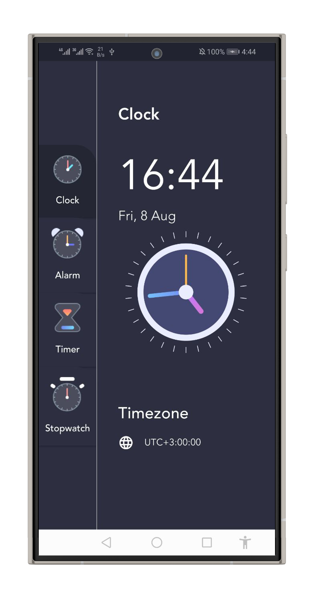
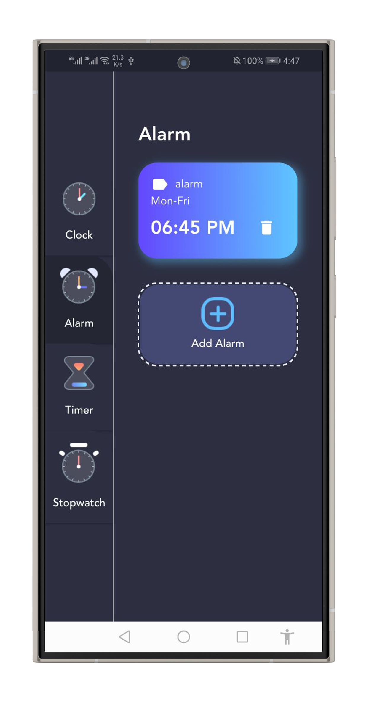
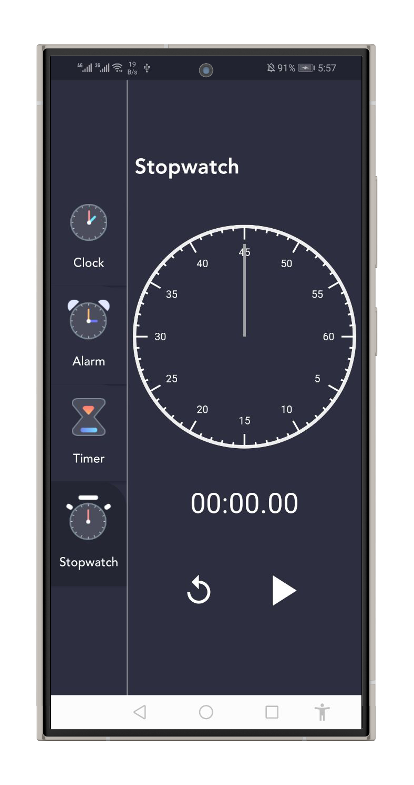
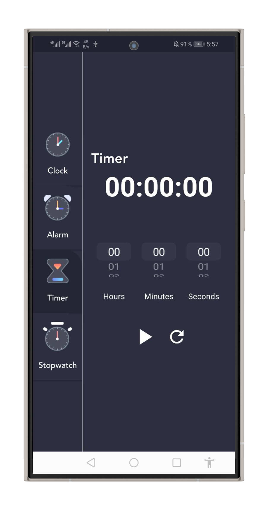

# 🕒 Flutter Clock App

A beautiful and functional **Clock App** built with **Flutter**, featuring:

- **Analog/Digital Clock**
- **Alarms** (with native Kotlin implementation)
- **Stopwatch**
- **Timer**

Data is persisted using **sqflite**, and app state is managed with **flutter_riverpod**.  
Alarms are implemented natively in **Kotlin** for reliable background execution.

---

## 📱 Features

### ⏰ Alarm
- Add, edit, and delete alarms.
- Stores alarms locally using **sqflite**.
- Native Kotlin alarm service for precise scheduling and background notifications.

### 🕓 Clock
- Real-time analog and digital clock display.

### ⏱ Stopwatch
- Start, pause, reset stopwatch.
- Tracks elapsed time accurately even in background.

### ⌛ Timer
- Set countdown timers with custom durations.

---

## 🛠 Tech Stack

- **Flutter** — UI framework
- **Kotlin** — Native Android alarm handling
- **flutter_riverpod** — State management
- **sqflite** — Local data storage
- **Android AlarmManager** — Alarm scheduling

---

## 📂 Project Structure

lib/
├── models/ # Data models
│ ├── alarm_info_model.dart
│ ├── clock_menu_option.dart
│ ├── menu_info_model.dart
│
├── providers/ # Riverpod providers for state management
│ ├── alarm_provider.dart
│ ├── clock_provider.dart
│ ├── menu_info_provider.dart
│ ├── stopwatch_provider.dart
│ ├── timer_provider.dart
│
├── services/ # Core services
│ ├── alarm_database_service.dart
│ ├── notification_service.dart
│
├── themes/ # App theme and colors
│ ├── app_colors.dart
│
├── widgets/ # Reusable UI components
│ ├── analog_clock.dart
│ ├── build_picker.dart
│ ├── clock_painter.dart
│ ├── custom_button.dart
│ ├── digital_clock.dart
│ ├── stopwatch_painter.dart
│
├── views/ # Screens / UI pages
│ ├── alarm_view.dart
│ ├── clock_view.dart
│ ├── home_view.dart
│ ├── stop_watch_view.dart
│ ├── timer_view.dart
│
├── main.dart


Native Kotlin code for alarms is located in: android/app/src/main/kotlin/com/example/alarm_clock/

---

## 🚀 Getting Started

### Prerequisites
- Flutter SDK (latest stable)
- Android Studio or VS Code
- Git

### Installation
```bash
# Clone the repository
git clone https://github.com/AhmedSakour/Clock_App

# Navigate into the project
cd Clock_App

# Install dependencies
flutter pub get

# Run the app
flutter run
```
---


 📸 Screenshots

| Clock | Alarm | Stopwatch | Timer |
|-------|-------|-----------|-------|
|  |  |  |  |


